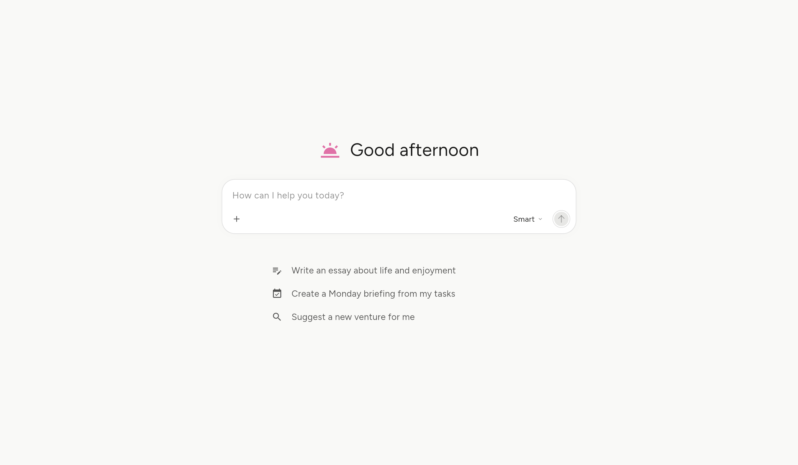

<p align="center">
  
</p>

<h1 align="center">flow_ui</h1>

<p align="center">
  <a href="https://pub.dev/packages/flow_ui"></a>
  <a href="https://pub.dev/packages/flow_ui/score"></a>
  <a href="https://github.com/StacDev/flow_ui"></a>
  <a href="https://github.com/StacDev/flow_ui/blob/main/LICENSE"></a>
</p>

<p align="center">
  📚 <a href="https://flowui.stac.dev/">Documentation</a>
  · 🧩 <a href="https://flowui.stac.dev/playground">Playground</a>
  · 🤓 <a href="https://pub.dev/documentation/flow_ui/latest/">API Reference</a>
  · 🗺️ <a href="https://flowui.stac.dev/roadmap">Roadmap</a>
</p>

<p align="center">
<a href="https://flowui.stac.dev/">Flow UI</a> is an open-source Flutter UI library to build production-grade Chat &amp; AI assistant interfaces.
</p>



> [!IMPORTANT]
> flow_ui is pre-1.0. The API is still settling, and minor releases may
> carry breaking changes — pin a minor version and read the
> [changelog](CHANGELOG.md) when upgrading.

## What's in the box

| Component | What it does |
|---|---|
| [`FlowChatView`](https://flowui.stac.dev/components/chat-view) | The full chat surface: bounded thread over a composer, centred at a readable width, with a zero state (greeting, lifted composer, starters) and a jump-to-latest button |
| [`FlowThread`](https://flowui.stac.dev/components/message-thread) | Scrollable conversation — reads from the top, anchoring to the newest message once it outgrows the viewport |
| [`FlowMessage`](https://flowui.stac.dev/components/message-thread) | One turn — ink-wash user bubble, plain assistant, error bubble, typed content parts |
| [`FlowStreamingText`](https://flowui.stac.dev/components/streaming-text) | Animated text reveal while a reply arrives |
| [`FlowThinkingIndicator`](https://flowui.stac.dev/components/thinking-indicator) | Turning, breathing asterisk with a shimmering label |
| [`FlowShimmerText`](https://flowui.stac.dev/components/shimmer-text) | Sweeping text highlight, static once settled |
| [`FlowCodeBlock`](https://flowui.stac.dev/components/code-block) | Fenced code with built-in synchronous highlighting, a header label, and a copy affordance — languages host-extensible |
| [`FlowMarkdown`](https://flowui.stac.dev/components/markdown) | Assistant prose typeset from a built-in parser — headings, emphasis, lists, quotes, tables, links, and fences composing the code block; assistant turns render it by default and it streams gracefully |
| [`FlowErrorState`](https://flowui.stac.dev/components/error-state) | Failure card with a host-written message and retry pill — failed turns render it automatically |
| [`FlowMessageActions`](https://flowui.stac.dev/components/message-actions) | Copy / regenerate / edit / feedback row under a message |
| [`FlowComposer`](https://flowui.stac.dev/components/composer) | Multiline input with send/stop, attachments strip, and leading/trailing action slots |
| [`FlowMenu`](https://flowui.stac.dev/components/menu) | Icon-triggered menu with groups, submenus, and toggles — anchored card on desktop, bottom sheet on phones |
| [`FlowModelSelector`](https://flowui.stac.dev/components/model-selector) | Model picker with effort and overflow submenus, sheet on phones |
| [`FlowPill`](https://flowui.stac.dev/components/pill) | Removable pill for an enabled tool or mode in the composer's action row — label auto-drops on phones |
| [`FlowAttachmentGroup`](https://flowui.stac.dev/components/attachments) | Image and file tiles with a type pill |
| [`FlowAttachmentPreview`](https://flowui.stac.dev/components/attachments) | Full-screen image viewer with zoom and paging |
| [`FlowSuggestion`](https://flowui.stac.dev/components/suggestions) / [`FlowSuggestionGroup`](https://flowui.stac.dev/components/suggestions) | Prompt starters — plain or outlined; scroll, wrap, or column layouts |
| [`FlowGreeting`](https://flowui.stac.dev/components/greeting) | Zero-state headline |
| [`FlowTheme`](https://flowui.stac.dev/theming) | Design tokens (colors and typography) as a `ThemeExtension`, with light and dark presets |

## Getting started

```yaml
dependencies:
  flow_ui: ^0.2.0
```

Install the theme once (optional — without it, components fall back to a
preset matching the ambient brightness):

```dart
MaterialApp(
  theme: ThemeData(extensions: [FlowTheme.light()]),
  darkTheme: ThemeData(
    brightness: Brightness.dark,
    extensions: [FlowTheme.dark()],
  ),
)
```

The default typography — Google Sans and Google Sans Code — arrives through
[google_fonts](https://pub.dev/packages/google_fonts): each cut is fetched
from Google Fonts on first use and cached on the device, so the theme renders
as designed with no font setup. An app that must render offline on first
launch can ship the files under a `google_fonts/` asset folder, which the
package checks before the network.

## Build a chat screen

Messages are pure view models. Your app maps its own transport into
`FlowMessageData`, and streaming is data, not streams: while a reply arrives,
rebuild with `copyWith` carrying the grown text.

```dart
class ChatPage extends StatefulWidget {
  const ChatPage({super.key});

  @override
  State<ChatPage> createState() => _ChatPageState();
}

class _ChatPageState extends State<ChatPage> {
  final ScrollController _scroll = ScrollController();
  List<FlowMessageData> _messages = const [];
  bool _generating = false;

  void _send(String text) async {
    final id = DateTime.now().microsecondsSinceEpoch.toString();
    setState(() {
      _messages = [
        ..._messages,
        FlowMessageData.text(id: id, role: FlowMessageRole.user, text: text),
        // An empty pending reply renders the thinking indicator.
        FlowMessageData(
          id: '$id-reply',
          role: FlowMessageRole.assistant,
          status: FlowMessageStatus.pending,
        ),
      ];
      _generating = true;
    });

    // Feed chunks from your backend as they arrive.
    var streamed = '';
    await for (final chunk in myBackend.reply(text)) {
      streamed += chunk;
      setState(() {
        _messages = [
          ..._messages.sublist(0, _messages.length - 1),
          _messages.last.copyWith(
            parts: [FlowTextPart(streamed)],
            status: FlowMessageStatus.streaming,
          ),
        ];
      });
    }

    setState(() {
      _messages = [
        ..._messages.sublist(0, _messages.length - 1),
        _messages.last.copyWith(status: FlowMessageStatus.complete),
      ];
      _generating = false;
    });
  }

  @override
  Widget build(BuildContext context) {
    return Scaffold(
      body: FlowChatView(
        empty: _messages.isEmpty,
        greeting: const FlowGreeting(
          icon: Icons.wb_twilight,
          text: 'Good afternoon',
        ),
        suggestions: FlowSuggestionGroup(
          layout: FlowSuggestionLayout.column,
          suggestions: [
            FlowSuggestion(
              label: 'Write an essay about life and enjoyment',
              icon: Icons.edit_note,
              onTap: () => _send('Write an essay about life and enjoyment'),
            ),
            FlowSuggestion(
              label: 'Create a Monday briefing from my tasks',
              icon: Icons.event_available,
              onTap: () => _send('Create a Monday briefing from my tasks'),
            ),
          ],
        ),
        thread: FlowThread(
          messages: _messages,
          controller: _scroll,
          thinkingLabel: 'Thinking…',
        ),
        threadController: _scroll,
        jumpToLatestTooltip: 'Jump to latest',
        composer: FlowComposer(
          placeholder: 'How can I help you today?',
          isStreaming: _generating,
          onSend: _send,
          onStop: myBackend.stop,
        ),
      ),
    );
  }
}
```

`FlowChatView` is body-only — it builds no `Scaffold` and no app bar, so
your app keeps the chrome, the background, and the keyboard inset. See
[`example/lib/main.dart`](example/lib/main.dart) for a complete runnable
version of this page, and the [live playground](https://flowui.stac.dev/playground)
for a demo of every component with variants and code snippets.

## Composer accessories

The composer takes leading and trailing action slots. Drop in a `FlowMenu`
(attachments, toggles) and a `FlowModelSelector` — both render an anchored
card on wide layouts and a bottom sheet on phones:

```dart
FlowComposer(
  onSend: _send,
  leadingActions: [
    FlowMenu(
      icon: Icons.add,
      tooltip: 'Add to chat',
      entries: const [
        FlowMenuOption(id: 'files', icon: Icons.attach_file, label: 'Add files'),
        FlowMenuDivider(),
        FlowMenuOption(id: 'web', icon: Icons.public, label: 'Web search', selected: true),
      ],
      onSelected: _handleMenu,
    ),
  ],
  trailingActions: [
    FlowModelSelector(
      models: const [
        FlowModelOption(id: 'fast', label: 'Fast', description: 'Quick answers'),
        FlowModelOption(id: 'smart', label: 'Smart', description: 'Hard problems'),
      ],
      selectedId: _modelId,
      onSelected: (id) => setState(() => _modelId = id),
    ),
  ],
)
```

## Message content is typed parts

A message holds an ordered list of sealed `FlowMessagePart`s —
`FlowTextPart`, `FlowAttachmentPart`, and `FlowCustomPart` for anything the
package doesn't know about. Custom parts render through a builder you supply,
so hosts can inject arbitrary widgets (tool cards, citations, charts) without
forking the message renderer:

```dart
FlowThread(
  messages: _messages,
  customPartBuilder: (context, message, part) {
    return switch (part.type) {
      'order-card' => OrderCard(order: part.data as Order),
      _ => null, // unknown parts are skipped
    };
  },
)
```

Attachments carry an `ImageProvider`, so network, file, memory, and asset
images all work — the package never loads anything itself:

```dart
FlowMessageData(
  id: 'm1',
  role: FlowMessageRole.user,
  parts: [
    FlowAttachmentPart([
      FlowAttachment(id: 'a1', thumbnail: NetworkImage(url), kind: 'JPG', label: 'sunset.jpg'),
    ]),
    FlowTextPart('What do you think of this shot?'),
  ],
)
```

## Theming

`FlowTheme` carries two token sets — colors and typography. Role names follow
Material 3's `ColorScheme`, so an existing scheme maps across, with one
addition: the design draws content at three ink levels (`onSurface`,
`onSurfaceVariant`, `onSurfaceMuted`) where M3 names two. Start from a preset
and override what your brand needs:

```dart
FlowTheme(
  colors: FlowColors.dark.copyWith(primary: const Color(0xFF6C5CE7)),
  typography: FlowTypography.standard,
)
```

Spacing and corner radii are deliberately not tokens. Following Material's
structure, each component bakes its own metrics from the Flow UI design file
and exposes per-widget overrides (`padding:`, `borderRadius:`) where hosts
retheme. Strings shown to the user (tooltips, placeholders, labels) are
host-supplied, so localization stays in your app — the one exception, the
model selector's `effortLabel` and `moreModelsLabel` English defaults, is
overridable the same way.

## Docs & playground

Full documentation lives at [flowui.stac.dev](https://flowui.stac.dev/), and
every component has a stage in the
[live playground](https://flowui.stac.dev/playground) — variant pills and
code snippets included. The playground is also
[in the repo](https://github.com/StacDev/flow_ui/tree/main/playground) to run
locally:

```bash
cd playground && flutter run -d chrome
```

## License

Code is released under the [MIT License](LICENSE). Google Sans and Google
Sans Code are Google's, under the [SIL Open Font
License](https://openfontlicense.org), and are fetched from Google Fonts
rather than bundled.
